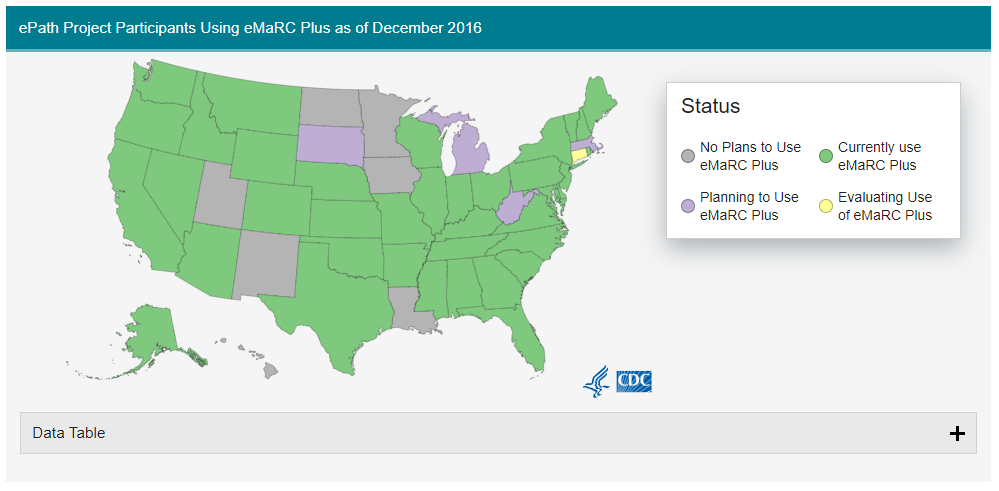

# Data Diagram Wireframes
February 5, 2020 | Glenn Abastillas

This folder contains the data diagram wireframes for registries. These wireframes are in .svg format and can be opened via [draw.io](draw.io) or Visio software.

## Contents 

Registries with data diagrams completed are listed below with the month and year of their latest versions. A link to a draft of the new data diagram template for each state accessible via the link in the parenthesis.

State |  8/2018 | 1/2020 | 02/2020
--- | --- | --- | ---
[Connecticut](#Connecticut) ([New](#Connecticut_New)) | | | &check;
[Detroit](#Detroit) ([New](#Detroit_New)) | | &check; |
[Georgia](#Georgia) ([New](#Georgia_New)) | &check; | |
[Greater_Bay_Area_of_California](#Greater_Bay_Area_of_California) ([New](#Greater_Bay_Area_of_California_New)) | | | &check;
[Greater_California](#Greater_California) ([New](#Greater_California_New)) | | &check; |
[Hawaii](#Hawaii) ([New](#Hawaii_New)) | | | &check;
[Iowa](#Iowa) ([New](#Iowa_New)) | | | &check;
[Kentucky](#Kentucky) ([New](#Kentucky_New)) | | | &check;
[Los_Angeles](#Los_Angeles) ([New](#Los_Angeles_New)) | | | &check;
[Louisiana](#Louisiana) ([New](#Louisiana_New)) | | | &check;
[New_Mexico](#New_Mexico) ([New](#New_Mexico_New)) | | | &check;
[New_York](#New_York) ([New](#New_York_New)) | | | &check;
[Seattle](#Seattle) ([New](#Seattle_New)) | &check; | |
[Utah](#Utah) ([New](#Utah_New)) | | &check; |

---

#### Data References and the Draft Schemas 

  1. [eMaRC Plus Coverage](#emarc)
  2. [Master schema draft](#master_schema_draft)
---

### eMaRC Plus Coverage 

Electronic Mapping, Reporting, and Coding (eMaRC) Plus coverage map screenshot taken in Feb. 10 2020. Status of coverage reported as last updated December 2016. [More information about eMaRC Plus can be found on the CDC's website.](https://www.cdc.gov/cancer/npcr/tools/registryplus/mp.htm).
([Back to Top](#contents))

### Master Schema Draft 

This draft is a redesign and simplification of the original source data diagrams presented in subsequent sections. The aim of this master schema draft (MSD) is to accurately convey as much information regarding the flow of data from data sources to SEER\*DMS in the simplest visual manner as possible.
([Back to Top](#contents))

### Connecticut 
Registry data flow diagram show how data flows from data sources to SEER\*DMS. ([Back to Top](#contents))

##### Meeting Notes

Date | Note
--- | ---
2/13/2020 | Registry did not agree with all the metrics presented in the PPT
2/13/2020 | Marina asked Jennifer Stevens to review her pull and the instructions to get those data just to confirm.
2/13/2020 | JS histological confirmation comes from the CTC not the path report.
2/13/2020 | JS just looking at the specimen date, it includes reports that must have been linked to a CTC
2/13/2020 | IMS needs to double check with regard to how they are calculating statistics based on PDFs, ePath, and paper reports coming to the registry for coverage.
2/13/2020 | Will need to rerun the metrics and will use 2018 and 2019 data instead
2/13/2020 | From AIM, data goes to registry, get uploaded manually through WSAPI
2/13/2020 | Data through PHINMS, data goes to registry, processed in transmed and then uploaded to IMS

### Detroit 
Registry data flow diagram show how data flows from data sources to SEER\*DMS. ([Back to Top](#contents))

### Georgia 
Registry data flow diagram show how data flows from data sources to SEER\*DMS. ([Back to Top](#contents))

### Greater_Bay_Area_of_California 
Registry data flow diagram show how data flows from data sources to SEER\*DMS. ([Back to Top](#contents))

### Greater_California 
Registry data flow diagram show how data flows from data sources to SEER\*DMS. ([Back to Top](#contents))

### Hawaii 
Registry data flow diagram show how data flows from data sources to SEER\*DMS. ([Back to Top](#contents))

Notes from 2/7/2020 -- Responses are from HI

    1. AIM CNS Imagining is not implemented. Not part of their normal processing.
    1. AIM EPath Network probably not being used, HI was not familiary with its implementation.
    1. EPath Monitor is realistically just there for a QC of sorts.
    1. After AIM processing, the files go to the in-house DB processing system.
    1. For paper reports, it would be an external source called FAX. It is scanned into an internal document management system and then data entered into SEER\*DMS.
    1. Currently not utilizing DMS's imaging system.
    1. All images are external to SEER*DMS

### Iowa 
Registry data flow diagram show how data flows from data sources to SEER\*DMS. ([Back to Top](#contents))

### Kentucky 
Registry data flow diagram show how data flows from data sources to SEER\*DMS. ([Back to Top](#contents))

### Los_Angeles 
Registry data flow diagram show how data flows from data sources to SEER\*DMS. ([Back to Top](#contents))

### Louisiana 
Registry data flow diagram show how data flows from data sources to SEER\*DMS. ([Back to Top](#contents))

##### Meeting Notes

Date | Note
--- | ---
2/20/2020 | Add PHINMS, Fax, and Mail routes
2/20/2020 | Change sFTP route to go through the registry's local file system first
2/20/2020 | New route that goes through APHL (sFTP) to the state's DoH, which sFTPs the data to the registry

### New_Mexico 
Registry data flow diagram show how data flows from data sources to SEER\*DMS. ([Back to Top](#contents))

Notes from 2/12/2020
	1. NM to change processes to better link scanned reports to CTCs as opposed to patient profile.

### New_York 
Registry data flow diagram show how data flows from data sources to SEER\*DMS. ([Back to Top](#contents))

### Seattle 
Registry data flow diagram show how data flows from data sources to SEER\*DMS. ([Back to Top](#contents))

### Utah 
Registry data flow diagram show how data flows from data sources to SEER\*DMS. ([Back to Top](#contents))

## New Data Diagrams 

### Connecticut (New) 
Registry data flow diagram show how data flows from data sources to SEER\*DMS. ([Back to Top](#contents))

### Detroit (New) 
Registry data flow diagram show how data flows from data sources to SEER\*DMS. ([Back to Top](#contents))

### Georgia (New) 
Registry data flow diagram show how data flows from data sources to SEER\*DMS. ([Back to Top](#contents))

### Greater_Bay_Area_of_California (New) 
Registry data flow diagram show how data flows from data sources to SEER\*DMS. ([Back to Top](#contents))

### Greater_California (New) 
Registry data flow diagram show how data flows from data sources to SEER\*DMS. ([Back to Top](#contents))

### Hawaii (New) 
Registry data flow diagram show how data flows from data sources to SEER\*DMS. ([Back to Top](#contents))

### Iowa (New) 
Registry data flow diagram show how data flows from data sources to SEER\*DMS. ([Back to Top](#contents))

### Kentucky (New) 
Registry data flow diagram show how data flows from data sources to SEER\*DMS. ([Back to Top](#contents))

### Los_Angeles (New) 
Registry data flow diagram show how data flows from data sources to SEER\*DMS. ([Back to Top](#contents))

### Louisiana (New) 
Registry data flow diagram show how data flows from data sources to SEER\*DMS. ([Back to Top](#contents))

### New_Mexico (New) 
Registry data flow diagram show how data flows from data sources to SEER\*DMS. ([Back to Top](#contents))

Notes from 2/12/2020
	1. NM to change processes to better link scanned reports to CTCs as opposed to patient profile.

### New_York (New) 
Registry data flow diagram show how data flows from data sources to SEER\*DMS. ([Back to Top](#contents))

### Seattle (New) 
Registry data flow diagram show how data flows from data sources to SEER\*DMS. ([Back to Top](#contents))

### Utah (New) 
Registry data flow diagram show how data flows from data sources to SEER\*DMS. ([Back to Top](#contents))
